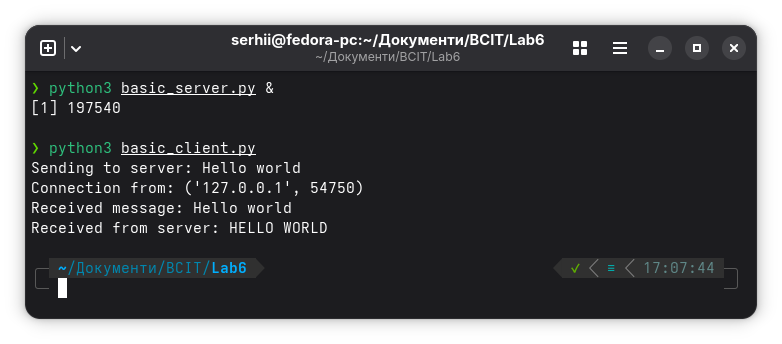
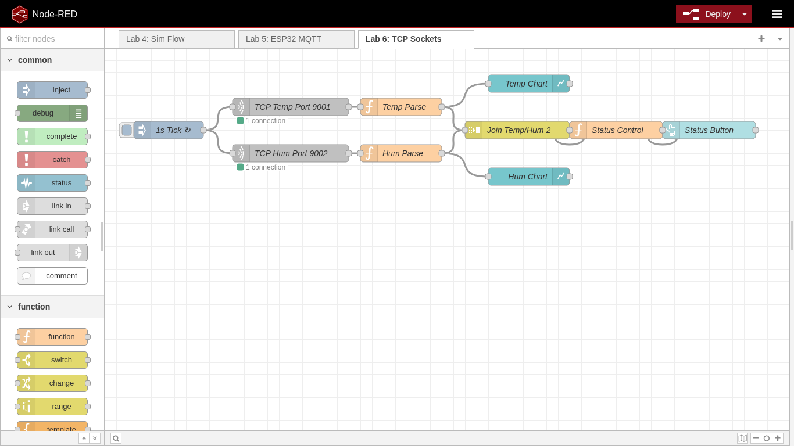
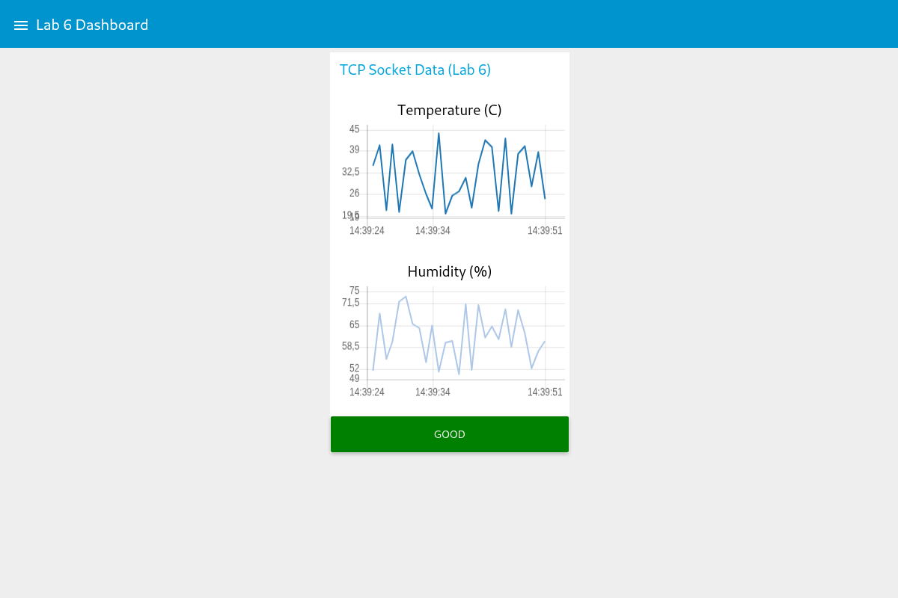

# Lab Work 6: Network Interaction via TCP Sockets

This project is a laboratory work for the "Fundamentals of Computer-Integrated Technologies" course.

## Description

The lab covers the development and research of network interaction of application processes using TCP sockets in automation systems. It includes implementing basic client-server communication, building TCP servers for sensor data simulation, and integrating with Node-RED for real-time monitoring.

## Prerequisites

- Python 3.x installed
- Podman installed and configured
- Node-RED running in a container (see Lab 4)

## How to Set Up and Run

### 1. Basic TCP Client-Server

Start the server in one terminal:

```bash
python3 basic_server.py
```

In another terminal, run the client:

```bash
python3 basic_client.py
```

The client sends "Hello world" to the server, which responds with the uppercase version.



### 2. Sensor Data Servers (Variant 24)

Start the temperature server (port 9001):

```bash
python3 temp_server.py
```

Start the humidity server (port 9002):

```bash
python3 hum_server.py
```

Both servers generate random values in the range 20-44 (temperature) and 50-74 (humidity) and respond to TCP connections.

### 3. Node-RED Integration

The Node-RED flow uses TCP request nodes to poll the Python servers. Since Node-RED runs inside a Podman container, it connects to the host via `host.containers.internal`.



### 4. HMI Dashboard

The dashboard displays real-time charts for temperature and humidity, plus a status indicator with hysteresis:

- **GOOD** when T ≤ 34.4 AND H ≤ 64.4
- **BAD** when T > 40.4 OR H > 70.4

Access the dashboard at:

```
http://127.0.0.1:1880/ui/
```



## Contributing

Contributions are welcome and appreciated! Here's how you can contribute:

1. Fork the project
2. Create your feature branch (`git checkout -b feature/AmazingFeature`)
3. Commit your changes (`git commit -m 'Add some AmazingFeature'`)
4. Push to the branch (`git push origin feature/AmazingFeature`)
5. Open a Pull Request

Please make sure to update tests as appropriate and adhere to the existing coding style.

## License

This project is licensed under the CSSM Unlimited License v2.0 (CSSM-ULv2). See the [LICENSE](LICENSE) file for details.
